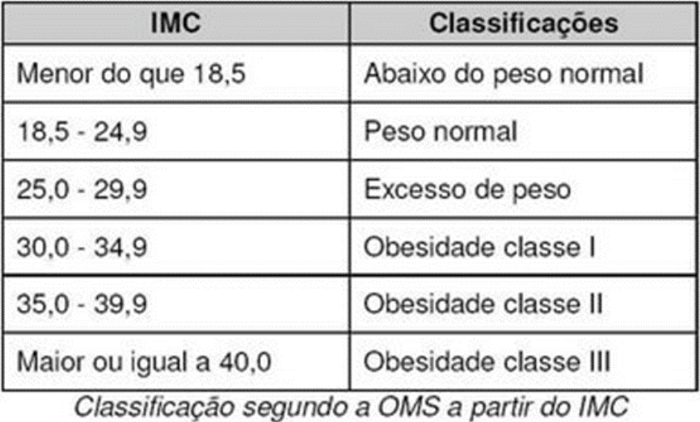

# 2023S1 - Desenvolvimento Web - AC1 Atividade 02

1. (3,0) Crie um formulário para cálculo do IMC usando **Reactive Forms**

    O formulário terá os campos
    - [x] "peso" e
    - [x] "altura", e
    - [x] ao ser submetido, exibirá o resultado do cálculo do IMC.
    - [x] Ambos os campos são **obrigatórios** e o usuário só conseguirá verificar o IMC `se ambos forem preenchidos`.

    - [x] Além da obrigatoriedade, o campo peso deverá ter um validador de
        - [x]  min = 1 e
        - [x] max = 500.

    - [x] Além da obrigatoriedade, o campo altura deverá ter um validador de
        - [x] min = 0,01 e
        - [x] max = 3.

1. (2,0) Para calcular o IMC faça:
    - [x] peso / (altura * altura);

1. (2,0) Exiba o IMC na tela e sua classificação,

    - [x] mediante a tabela abaixo:
    

1. (3,0) Construa uma página explicando o IMC e com algumas informações de como ele funciona, para que ser e um botão “Calcule seu IMC”,
    - [x] ao clicar nesse botão deverá abrir o componente da calculadora que você criou nos passos anteriores.

---

This project was generated with [Angular CLI](https://github.com/angular/angular-cli) version 15.1.5.

## Development server

Run `ng serve` for a dev server. Navigate to `http://localhost:4200/`. The application will automatically reload if you change any of the source files.

## Code scaffolding

Run `ng generate component component-name` to generate a new component. You can also use `ng generate directive|pipe|service|class|guard|interface|enum|module`.

## Build

Run `ng build` to build the project. The build artifacts will be stored in the `dist/` directory.

## Running unit tests

Run `ng test` to execute the unit tests via [Karma](https://karma-runner.github.io).

## Running end-to-end tests

Run `ng e2e` to execute the end-to-end tests via a platform of your choice. To use this command, you need to first add a package that implements end-to-end testing capabilities.

## Further help

To get more help on the Angular CLI use `ng help` or go check out the [Angular CLI Overview and Command Reference](https://angular.io/cli) page.
